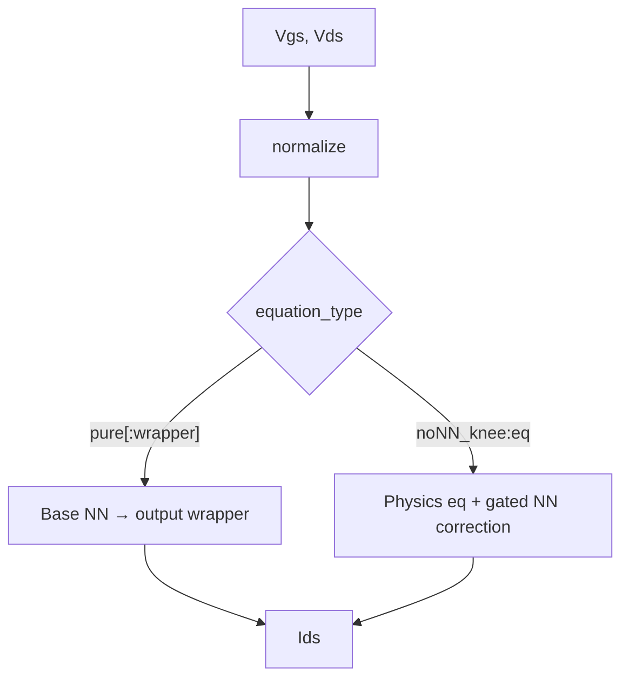
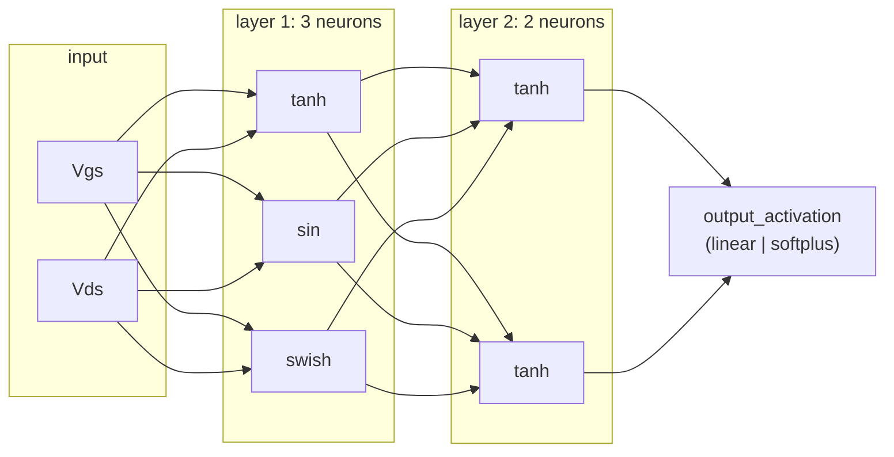
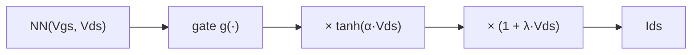
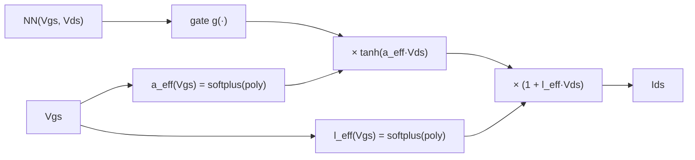
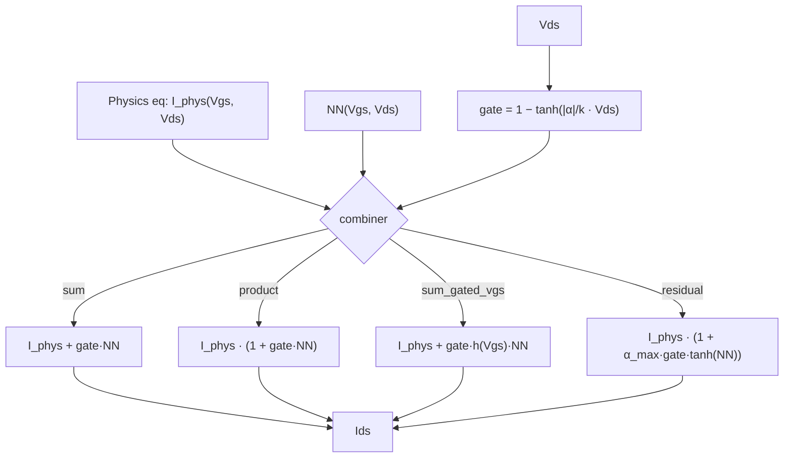
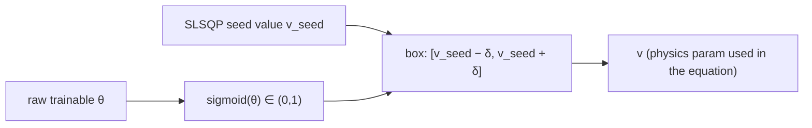

# Model architectures — how `Ids` is computed

This is a reference for every way `per_neuron_simple_angelov_nn_test.py` (via
`optim_utils/per_neuron_models.py`) can turn `(Vgs, Vds)` into a predicted drain
current `Ids`. It's driven entirely by the `equation_type` config string, whose
format is:

```
equation_type = "<mode>[:<wrapper_or_eq>]"
```

Two families are actually used across every config in `physics_nn_configs/`
(confirmed by grepping every `equation_type` value in the repo):

- **`pure[:<wrapper>]`** — the network *is* the model. An optional output
  **wrapper** reshapes its raw output into a physically-sane Ids-Vds curve.
- **`noNN_knee:<eq>`** — a physics equation (Angelov family) provides the
  baseline, and the network supplies a *gated correction* on top of it.



---

## 1. The base network

Every path starts with the same building block: a small feed-forward net where
**each neuron in a layer can have its own activation function** — not one
activation per layer, one *per neuron*. This is what an architecture string
encodes:

```
"[[\"tanh\",\"sin\",\"swish\"], [\"tanh\",\"tanh\"]]"
```



The **final layer's** activation is set separately by `output_activation`
(`linear` or `softplus`) — this is a property of the network itself, and is
**orthogonal** to the "wrapper" described in §2 (the wrapper post-processes
whatever the network already output).

---

## 2. Family A — Pure NN (`equation_type: "pure"` or `"pure:<wrapper>"`)

With no wrapper, the model is just:

$$I_{ds} = \mathrm{NN}(V_{gs}, V_{ds})$$

But a **wrapper** can reshape the raw network output into a curve that's
guaranteed to obey basic transistor physics (odd in `Vds`, exactly `0` at
`Vds=0`, correct sign) — this is what every `vdsgate*` config in this repo
actually uses.

### 2a. `vdsgate` / `vdsgatelin` — constant knee

$$I_{ds} = g(\mathrm{NN}) \cdot \tanh(\alpha \cdot V_{ds}) \cdot (1 + \lambda \cdot V_{ds})$$

- $\alpha = \mathrm{softplus}(\alpha_{raw}) > 0$ — a single learned scalar (the "knee steepness").
- $\lambda$ — a single learned scalar (linear Vds slope beyond the knee).
- $g(\cdot)$ — the *gate*: `vdsgate` uses $g=\mathrm{softplus}(\mathrm{NN})$ (guarantees
  $\mathrm{sign}(I_{ds})=\mathrm{sign}(V_{ds})$); `vdsgatelin` uses $g=\mathrm{NN}$ raw
  (more flexible, no sign guarantee).



### 2b. `vdsgate_aeff*` — Vgs-dependent knee (the family actually used most)

Same shape, but $\alpha$ and $\lambda$ become **polynomials in $V_{gs}$** instead
of constants — the knee position/slope now varies with gate voltage:

$$I_{ds} = g(\mathrm{NN}) \cdot \tanh\big(a_{eff}(V_{gs}) \cdot V_{ds}\big) \cdot \big(1 + l_{eff}(V_{gs}) \cdot V_{ds}\big)$$

$$a_{eff}(V_{gs}) = \mathrm{softplus}\Big(\sum_{i=0}^{N} a_i \cdot \hat V_{gs}^{\,i}\Big) \qquad
l_{eff}(V_{gs}) = \mathrm{softplus}\Big(\sum_{j=0}^{N-1} l_j \cdot \hat V_{gs}^{\,j}\Big)$$

($\hat V_{gs}$ = normalized Vgs.) The suffix picks the polynomial order $N$ and a
few optional variants:

| suffix | $a_{eff}$ order | notes |
|---|---|---|
| `_lin` | 1 | |
| `_quad` | 2 | most commonly used in this repo |
| `_cub` (bare `vdsgate_aeff` too) | 3 | |
| `_quart` / `_quint` / `_sext` / `_sept` | 4 / 5 / 6 / 7 | higher-order fits |
| `_sig` | — | $a_{eff}$ uses $2\cdot\mathrm{sigmoid}(\cdot)$ instead of softplus (bounded above too) |
| `_clam` | — | $l_{eff}$ forced to a **constant** (order 0) instead of order $N{-}1$ |
| `_freelam` | — | $l_{eff}$ = raw polynomial, unconstrained (can go negative) |



### 2c. `vdsgate_vdsk*` — Vgs-dependent knee, parameterized as a *voltage*

Same idea, but instead of a steepness $\alpha$, it directly models **where the
knee sits, in volts** — better-conditioned for curves near pinch-off, where the
physical knee shifts toward 0V:

$$I_{ds} = g(\mathrm{NN}) \cdot \tanh\!\left(\frac{V_{ds}}{V_{ds,knee}(V_{gs})}\right) \cdot \big(1 + l_{eff}(V_{gs}) \cdot V_{ds}\big)$$

$$V_{ds,knee}(V_{gs}) = \mathrm{softplus}\Big(\sum_{i=0}^{N} k_i \cdot \hat V_{gs}^{\,i}\Big) + 10^{-4}$$

Suffixes (`_lin`/`_quad`/`_cub`, `_clam`, `_freelam`) work the same way as §2b
(no `_sig` variant here).

---

## 3. Family B — Physics + NN hybrid (`equation_type: "noNN_knee:<eq>"`)

Here the network doesn't predict `Ids` at all — it predicts a **correction** on
top of a physics baseline, and a **gate** suppresses that correction in deep
saturation (where the physics equation is already reliable):



The gate is **not learned** (`.detach()`'d) — it's a fixed function of the
physics equation's own knee-steepness parameter $\alpha$ (or $\alpha_R$ for
`mod1_angelov`), so early in saturation (small $V_{ds}$) the gate is near 1 (NN
fully active) and deep in saturation it decays toward 0 (physics takes over):

$$\text{gate} = 1 - \tanh\!\left(\frac{|\alpha|}{k} \cdot V_{ds}\right), \qquad k = \texttt{knee\_alpha\_scale}$$

### 3a. `knee_combiner` — how the gated correction is applied

| `knee_combiner` | formula | when to use |
|---|---|---|
| `sum` (default) | $I_{phys} + \text{gate}\cdot \mathrm{NN}$ | simplest; NN adds/subtracts current directly |
| `product` | $I_{phys}\cdot(1+\text{gate}\cdot \mathrm{NN})$ | NN is a *percentage* correction, scales with $I_{phys}$ |
| `sum_gated_vgs` | $I_{phys} + \text{gate}\cdot h(V_{gs})\cdot \mathrm{NN}$ | adds a **second** gate $h(V_{gs})$ that fades the NN out below threshold (fixes gm bumps near pinch-off) |
| `residual` | $I_{phys}\cdot\big(1+\alpha_{max}\cdot\text{gate}\cdot[g_{V_{gs}}]\cdot\tanh(\mathrm{NN})\big)$ | bounds the correction to $\pm\alpha_{max}$ of $I_{phys}$; optional extra sigmoid $V_{gs}$ gate |

> **Not real:** `docs/README.md` also lists `max`/`min` as valid `knee_combiners`
> — these do not exist in the code (only the 4 above do; anything else silently
> falls back to `sum`).

### 3b. The physics equations (`<eq>`)

**`classic_angelov` / `angelov_6_term` / `angelov_9_term`** share one form —
only the polynomial order in $V_{gs}$ changes:

$$\psi = \sum_{n=1}^{N} P_n \cdot (V_{gs}-V_{pk})^n \qquad (N = 3, 6, \text{or } 9)$$

$$I_{phys} = I_{pk}\cdot(1+\tanh\psi)\cdot\tanh(\alpha\cdot V_{ds})\cdot(1+\lambda\cdot V_{ds})$$

More polynomial terms ($N{=}9$) fit the gm curve's shape more precisely but need
smaller learning rates on the high-order terms to stay numerically stable.

**`mod1_angelov`** is the advanced variant — it lets the peak voltage $V_{pk}$
and the knee steepness $\alpha$ **shift with $V_{ds}$** (captures current-collapse /
dispersion effects the simpler forms can't):

$$V_{pk}(V_{ds}) = V_{pks} - \delta V_{pks} + \delta V_{pks}\cdot\tanh(\alpha_S\cdot V_{ds})$$
$$\alpha_{eff}(V_{ds}) = \alpha_R + \alpha_S\cdot(1+\tanh(\psi_1))$$

with two conduction branches ($\psi_1$ centered on $V_{pk}$, $\psi_2$ on a
smoothed complementary voltage) combined before the same
$\tanh(\alpha_{eff}\cdot V_{ds})\cdot(1+\lambda\cdot V_{ds})$ envelope. See
`optim_utils/per_neuron_noNN.py:mod1_angelov` for the full 18-parameter form.

---

## 4. Tight-prior seeding (`use_opt_params` + `freeze_physics`)

Cross-cutting mechanism for the `noNN_knee` family: instead of training physics
params from scratch, seed them from an SLSQP physics-only fit and constrain each
to stay within **±10% of its seeded value**:

$$\delta = |v_{seed}| \cdot 0.10 \quad(\text{floored at } 10^{-6})$$
$$v = (v_{seed}-\delta) + \big[(v_{seed}+\delta) - (v_{seed}-\delta)\big]\cdot\mathrm{sigmoid}(\theta)$$

The raw trainable parameter is $\theta$; no matter what $\theta$ does, $v$ can
never leave $[v_{seed}-\delta,\ v_{seed}+\delta]$. Two regimes:

- **`freeze_physics: false`** — $\theta$ trains, $v$ refines within the ±10% box.
- **`freeze_physics: true`** — $\theta$ is never updated, $v$ stays exactly at $v_{seed}$.


