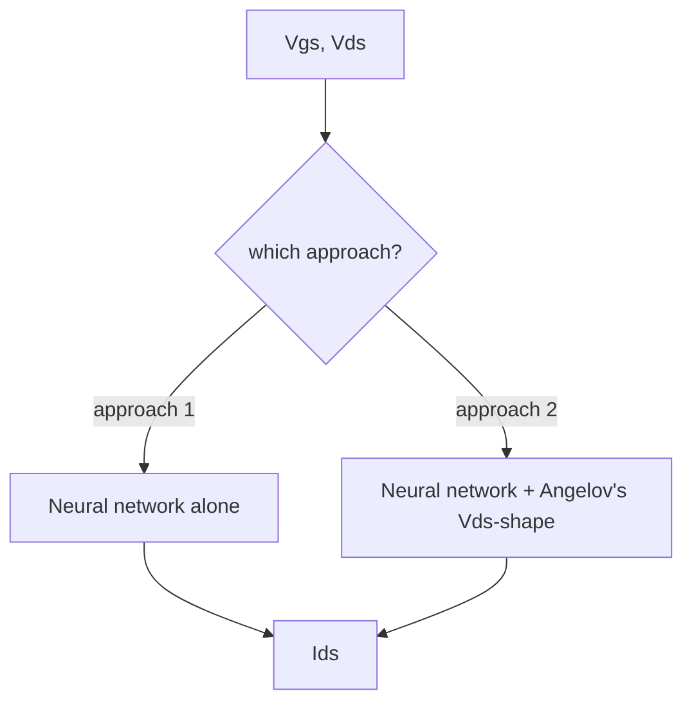
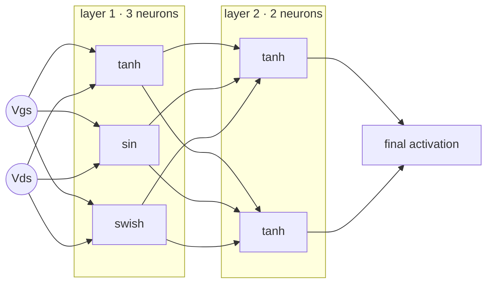
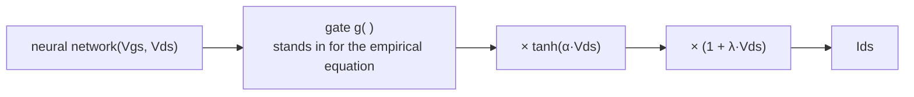
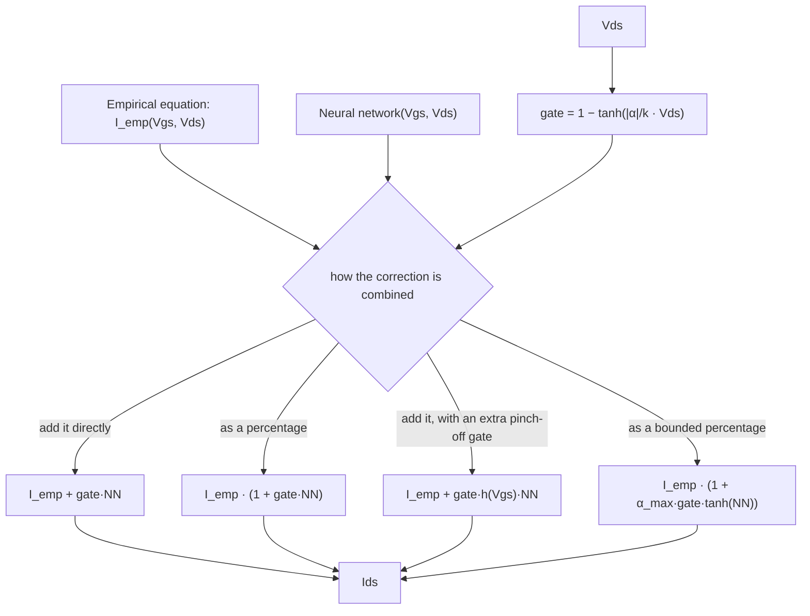
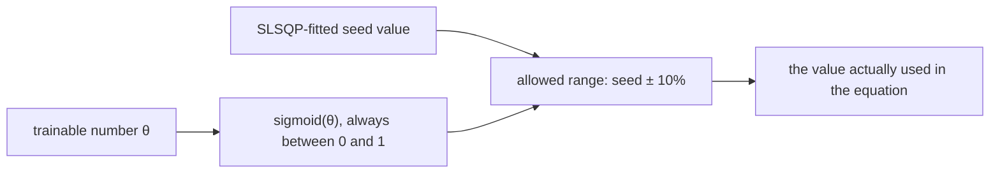

# Model architectures — how `Ids` is computed

This explains, in plain terms, how this codebase turns two numbers — `Vgs`
(gate voltage) and `Vds` (drain voltage) — into a predicted drain current
`Ids`. No prior ML or device-physics background assumed; jargon is defined
the first time it's used.

**Two modeling approaches are actually used in this project:**

- **The network predicts the current directly** — the network by itself,
  with nothing else built in.
- **The network's output is shaped to look like a transistor curve** — the
  network is combined with the same `Vds`-dependent shape the Angelov
  empirical equation uses, so the prediction automatically looks like a real
  transistor curve.



A third approach also exists, used in an earlier, separate line of
experiments, but isn't used anywhere in this project's current work — see
the note at the end.

---

## 1. The base network

Every path starts with the same kind of network: a small stack of layers
where — unusually — **each neuron in a layer can use a different activation
function**. Normal networks use one activation for a whole layer; here, one
layer might mix `tanh` and `sin` neurons side by side. An architecture string
like

```
[["tanh", "sin", "swish"], ["tanh", "tanh"]]
```

means: layer 1 has 3 neurons (tanh, sin, swish), layer 2 has 2 neurons (both
tanh).



The network's **very last step** squashes its output through one more
activation — usually `linear` (no squashing at all) or `softplus` (forces
the output to be ≥ 0, a soft ramp instead of a hard cutoff). See §2b for
what happens if you pick a *bounded* one instead (`sigmoid`, `tanh`).

---

## 2. The network predicts the current directly

### 2a. The network's raw prediction

$$I_{ds} = \mathrm{NN}(V_{gs}, V_{ds})$$

The network is asked to learn the whole curve by itself, with no known
transistor behavior built in. Simple, but nothing stops it from predicting
something physically silly (e.g. a nonzero current at `Vds = 0`, where a
real transistor always reads exactly zero).

### 2b. Bounded final activations need a "margin"

If that last squashing step is `sigmoid` (squashes to the range `(0, 1)`) or
`tanh` (squashes to `(-1, 1)`), there's a problem: real measured currents can
be several amps, but the network's raw output can never exceed 1. A sigmoid
output alone can never predict a 2.7 A current — it's mathematically capped.

The fix rescales the squashed output up to the real range:

$$I_{ds} = \text{scale} \cdot \text{activation}\big(\mathrm{NN}(V_{gs}, V_{ds})\big)$$
$$\text{scale} = (1 + \text{margin}) \cdot \max(I_{ds}^{\text{measured}})$$

`scale` is computed once, from the training data, before training starts.
With `margin = 0` (the default), `scale = 1` and bounded activations are
left uselessly capped at ±1 — so this project sets a margin whenever
`sigmoid`/`tanh` is used as the final activation (`0.1` is what this repo
actually uses: `scale = 1.1 × max(measured Ids)`, giving 10% headroom above
the largest value ever seen). Unbounded activations (`linear`, `softplus`)
don't need this at all — the margin is simply ignored for them.

| final activation | bounded? | needs a margin? |
|---|---|---|
| `linear` | no | no |
| `softplus` | no (≥0, but unbounded above) | no |
| `sigmoid` | yes, `(0,1)` | yes |
| `tanh` | yes, `(-1,1)` | yes |

(Verified directly in the repo's own experiments: the ones using `sigmoid`
and `tanh` as the final activation set a `0.1` margin; the ones using
`softplus` set no margin at all.)

---

## 3. The network's output shaped to look like a transistor curve

A second, independent squashing step can be applied *after* the network's
own final activation. It's how the network is made to automatically obey
basic transistor physics — exactly zero current at `Vds = 0`, current
flowing the correct direction — instead of hoping it learns that from data
alone.

**The key idea: it borrows its shape directly from the Angelov empirical
equation.** That equation looks like this — look at its *tail*, the part
that only depends on `Vds`:

$$\underbrace{I_{pk}\cdot(1+\tanh\psi)}_{\text{depends on }V_{gs}\text{ only}} \cdot\ \underbrace{\tanh(\alpha \cdot V_{ds})\cdot(1+\lambda \cdot V_{ds})}_{\text{depends on }V_{ds}\text{ only — the "envelope"}}$$

(`ψ` is a polynomial in `Vgs` — see §5 for the full Angelov formula and
what its symbols mean. It's not used as the *model* anywhere in this
project's current work; it only matters here for this one borrowed piece.)

This approach reuses that exact `Vds`-envelope — literally the same
`tanh(α·Vds)·(1+λ·Vds)` formula — but **replaces the empirically-derived
`Vgs`-dependent part with the neural network**:

$$I_{ds} = \underbrace{g(\mathrm{NN})}_{\substack{\text{network stands in}\\\text{for the empirical term}}} \cdot\ \underbrace{\tanh(\alpha \cdot V_{ds})\cdot(1+\lambda \cdot V_{ds})}_{\text{same envelope as Angelov}}$$

- $g(\cdot)$ is a small "gate" function on the network's raw output — by
  default $g = \mathrm{softplus}(\mathrm{NN})$, which keeps the sign of
  `Ids` locked to the sign of `Vds` (physically required).
- $\alpha$ (steepness) and $\lambda$ (slope) are just two extra learned
  numbers, same role as in the Angelov equation.



**The version actually used most in this repo takes this one step
further**: instead of fixed numbers, $\alpha$ and $\lambda$ become small
polynomials *in* `Vgs` (so the knee shape can change across the gate
voltage range, not stay identical everywhere):

$$I_{ds} = g(\mathrm{NN}) \cdot \tanh\big(a_{eff}(V_{gs}) \cdot V_{ds}\big) \cdot \big(1 + l_{eff}(V_{gs}) \cdot V_{ds}\big)$$

How complex that polynomial is allowed to be is a tunable choice:

| complexity | polynomial order | meaning |
|---|---|---|
| simplest | 1 | straight line in Vgs |
| **most used in this repo** | 2 | curve |
| more flexible | 3 | more flexible curve |
| higher-order | 4–7 | rarely needed |

A few extra variants are also available: bounding the steepness term with a
sigmoid instead of an unbounded ramp; fixing the slope to a single constant
instead of letting it vary with `Vgs`; or letting the slope go negative
(unconstrained) instead of staying non-negative.

A close cousin models the same idea but stores *where the knee sits, in
volts* directly, instead of a steepness number — more numerically stable
for curves very close to pinch-off:

$$I_{ds} = g(\mathrm{NN}) \cdot \tanh\!\left(\frac{V_{ds}}{V_{ds,knee}(V_{gs})}\right) \cdot \big(1 + l_{eff}(V_{gs}) \cdot V_{ds}\big)$$

---

## 4. Which one is used where

The 9069-architecture base sweep and everything derived from it (the
best-ids shortlists, retrained across all 6 measurement CSVs, consistency
checks — see [`SWEEP_METHODOLOGY.md`](SWEEP_METHODOLOGY.md)) uses **only**
the two approaches above:

- The final-activation experiments (`sigmoid` + margin, `tanh` + margin,
  `softplus`, and their gm-loss-free counterparts) use **approach 1** —
  the network predicting current directly.
- Two of the experiment groups use **approach 2** — the network's output
  shaped like a transistor curve, in its most-flexible (curve-order 2)
  variant.

Nowhere in that sweep does the empirical+NN hybrid described in §5 appear —
that's a separate, parallel line of experiments (see below).

---

## 5. Also explored, not used in this project's current work

A third approach exists, used in a separate set of earlier experiments, but
**not** in the 9069/sweep-methodology work above. Documented here for
completeness, in case those experiments are picked back up.

Here the empirical equation is the model, and the network only supplies a
small, gated *correction* on top of it.

**The empirical equation itself (the Angelov family).**
The classic, 6-term, and 9-term Angelov equations are the same formula with
a longer or shorter polynomial in `Vgs`:

$$\psi = \sum_{n=1}^{N} P_n \cdot (V_{gs}-V_{pk})^n \qquad (N = 3,\ 6,\ \text{or } 9)$$

$$I_{emp} = \underbrace{I_{pk}\cdot(1+\tanh\psi)}_{\text{"how much current, as a function of } V_{gs}\text{"}} \cdot\ \underbrace{\tanh(\alpha\cdot V_{ds})\cdot(1+\lambda\cdot V_{ds})}_{\text{"the } V_{ds}\text{ envelope"}}$$

More polynomial terms ($N=9$) trace the curve's shape more precisely, at the
cost of needing smaller learning rates on the higher-order terms to avoid
blowing up. A more advanced variant lets the peak voltage and steepness
*themselves* shift with `Vds` — see
`optim_utils/per_neuron_noNN.py:mod1_angelov` for its full form.

**The gate.** A gate decides how much the network's correction is allowed
to contribute, fading toward zero as `Vds` grows:

$$\text{gate} = 1 - \tanh\!\left(\frac{|\alpha|}{k} \cdot V_{ds}\right)$$

It reuses the empirical equation's own $\alpha$ rather than being learned
separately, so it automatically matches how steep that equation's knee is.



**How the correction is folded in** — four options:

| way it's combined | formula | plain-language meaning |
|---|---|---|
| add it directly (default) | $I_{emp} + \text{gate}\cdot\mathrm{NN}$ | network adds/subtracts current directly |
| as a percentage | $I_{emp}\cdot(1+\text{gate}\cdot\mathrm{NN})$ | network's output is a *percentage* nudge on the empirical-equation prediction |
| add it, with an extra pinch-off gate | $I_{emp} + \text{gate}\cdot h(V_{gs})\cdot\mathrm{NN}$ | adds a *second* gate that also fades the network out near pinch-off (fixes a common gm "bump" artifact there) |
| as a bounded percentage | $I_{emp}\cdot(1+\alpha_{max}\cdot\text{gate}\cdot\tanh(\mathrm{NN}))$ | caps the correction to at most $\pm\alpha_{max}$ of the empirical-equation prediction, so it can never run away |

**Tight-prior seeding** is a trick used only with this family: rather than
training the empirical equation's parameters from a random start, seed them
from an empirical-only fit (done separately via SLSQP — see
`docs/README.md` §4), then keep each parameter **within ±10% of that
seeded value** during training:

$$\delta = |v_{seed}| \cdot 0.10$$
$$v = (v_{seed}-\delta) + \big[(v_{seed}+\delta)-(v_{seed}-\delta)\big]\cdot\mathrm{sigmoid}(\theta)$$

$\theta$ is the actual trainable number, but no matter what value it takes,
`sigmoid(θ)` always stays between 0 and 1 — so `v` can *never* leave its
±10% box.

- **Trained** — `θ` trains; `v` refines anywhere inside the box.
- **Frozen** — `θ` never updates; `v` stays exactly at its seed.


