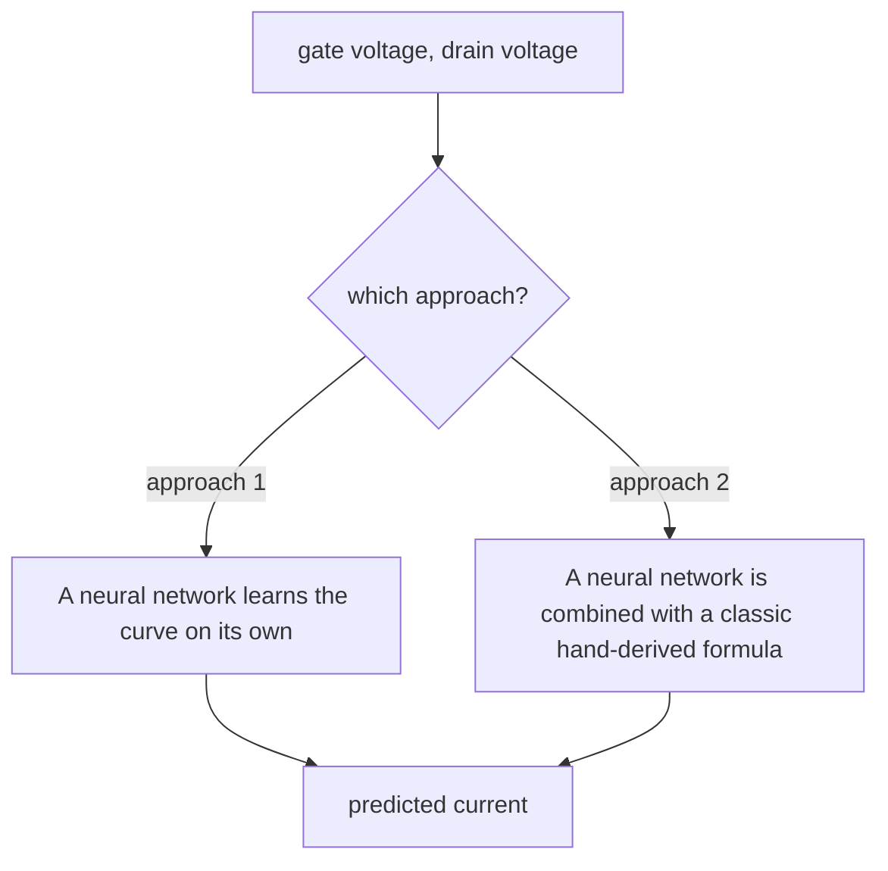
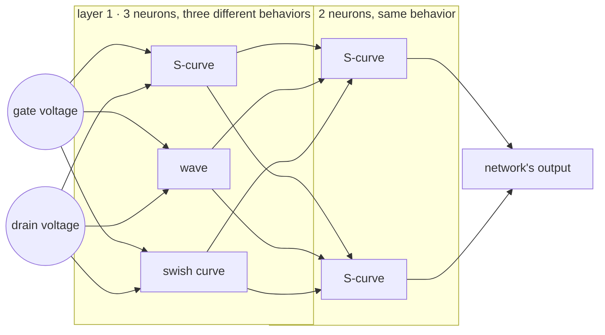
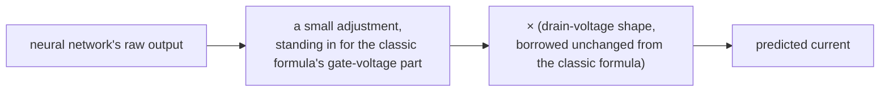

# How the transistor current models work

*A plain-language explainer — no coding or engineering background assumed.
For the technical reference with exact config names and formulas, see*
[`MODEL_ARCHITECTURES.md`](MODEL_ARCHITECTURES.md).

The goal of this project is to predict the current flowing through a
transistor (`Ids`) given two voltages applied to it: the gate voltage
(`Vgs`) and the drain voltage (`Vds`). Two different approaches are used to
build that prediction.

---

## The network itself

Both approaches use the same kind of neural network — a small stack of
layers of artificial "neurons." What's unusual here is that **neurons in
the same layer are allowed to use different math functions from each
other** (called activation functions), rather than every neuron in a layer
doing the same thing. One layer might have some neurons behaving like a
smooth "S" curve and others behaving like a wave, side by side.

---

## Approach 1: the network learns the curve on its own

The simplest option: the network is just given the two voltages and asked
to predict the current, with nothing else built in. It has to figure out
the whole shape of the curve from the measured data alone.

One wrinkle: some versions of the network squash their output into a fixed
range before it comes out (for example, forcing it to always land between
0 and 1). But real currents can be several amps — far bigger than 1 — so if
that squashing is used, the network's answer has to be stretched back out
afterward to reach the real range. That stretching amount is worked out
once from the measured data (specifically, from the largest current ever
seen) before training even starts, with a bit of extra headroom added on
top so the network isn't left straining against its own ceiling.

---

## Approach 2: shaping the network's output like a real transistor

Real transistors always behave a certain way: at zero drain voltage, the
current is always exactly zero, and the current only flows in the
direction the drain voltage pushes it. A network trained with no guidance
at all (approach 1) has no guarantee of getting that right — it might
predict some small leftover current at zero, which isn't physically
possible.

To fix this, the network's output can instead be passed through an extra
shaping step that **automatically forces that correct behavior**, no
matter what the network itself predicts. This shaping step is borrowed
directly from a well-known, decades-old hand-derived formula for
transistor current (the "Angelov equation," named after its author) — or
more precisely, borrowed from *half* of it.

That classic formula has two parts multiplied together: one part that
depends only on the gate voltage, and one part that depends only on the
drain voltage. The drain-voltage part is a well-tested shape that already
guarantees the zero-at-zero, correct-direction behavior real transistors
have. This project's shaping step reuses that exact drain-voltage part
unchanged, and simply **replaces the other part — the gate-voltage part —
with the neural network**:

In the most advanced version of this used in the project, that borrowed
drain-voltage shape is allowed to change gradually as the gate voltage
changes, instead of staying exactly the same everywhere — giving the model
a bit more flexibility while still keeping the guaranteed real-transistor
behavior.

---

## A note on a third approach

Earlier in the project, a different idea was also explored: instead of the
network shaping its own output, the classic hand-derived formula *itself*
was used as the main prediction, with the network only allowed to add a
small correction on top — one that automatically fades away in regions
where the classic formula was already known to be reliable. That approach
isn't part of the project's current, active work — the two approaches
above are what's actually used now.
