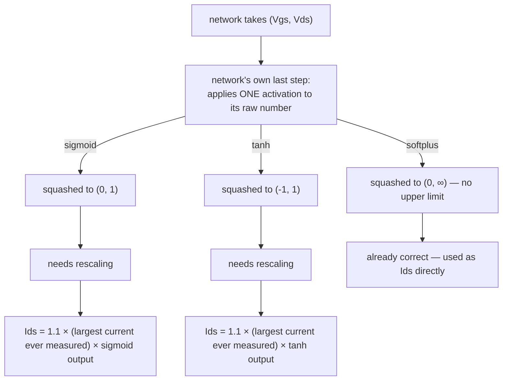

# `sigmoid_margin10` / `tanh_margin10` / `softplus` — exactly what happens

**No wrapper is involved in any of these three. None.** This doc exists
specifically to confirm that in plain, unambiguous terms, because it came
up as a point of confusion.

All three are the network predicting the current directly — nothing else
built in, no borrowed formula, no extra multiplication step. The only
thing that differs between the three is **which single squashing function
is applied to the network's raw output**, and whether a rescaling
correction is needed afterward.

## Confirmed directly in the configs

All three experiment groups use the exact same setting for "which
approach": `equation_type: "pure"` — the plain string `"pure"`, nothing
after it, no colon, no wrapper name attached. Verified by reading the
actual config files (`pure_combined9069_sigmoid_margin10_batch1_gmvds3.json`,
`..._tanh_margin10_...`, `..._softplus_...`).

## Confirmed directly in the code

The parsing function has a **dedicated early check** for exactly this case:

```python
if equation_type == "pure":
    return "pure", "none", False, "identity", 2
    #                              ^^^^^^^^^^
    #                              nn_wrapper = "identity"
```

`"identity"` is a real, explicit value here — not a placeholder. Later,
when the code decides how to shape the network's output, it walks through
a list of wrapper options (`tanh`, `sigmoid`, `softplus`, `vdsgate`,
`vdsgate_aeff*`, `vdsgate_vdsk*`, ...) and `"identity"` matches **none of
them** — it always falls through to the final, do-nothing case:

```python
else: nn_act = nn_raw  # identity: pass the number through unchanged
```

So the code path for these three sweeps never even reaches the wrapper
logic — `nn_wrapper = "identity"` means "apply nothing," full stop. This
isn't a matter of interpretation; it's guaranteed by these two pieces of
code working together.

## So what does happen, step by step



- **`sigmoid`**: the network's number is squashed into the range `(0, 1)`.
  Real currents go up to several amps, so `(0, 1)` alone is far too small —
  the result gets multiplied by `1.1 × (the largest current seen in the
  measured data)`, computed once before training starts. Final
  `Ids = 1.1 × max(measured Ids) × sigmoid(raw)`.
- **`tanh`**: same idea, squashed into `(-1, 1)` instead, same rescaling
  applied. Final `Ids = 1.1 × max(measured Ids) × tanh(raw)`.
- **`softplus`**: squashed into `(0, ∞)` — there's no upper limit, so it can
  already reach any real current value on its own. No rescaling is applied
  (or needed). Final `Ids = softplus(raw)`, directly.

That's the entire mechanism. In all three cases: one activation function,
applied once, to the network's own raw number — optionally followed by a
single multiplication to fix the range for the two bounded ones. Nothing
about the Angelov equation, the "envelope," or any wrapper is involved
anywhere in this.

## Where the wrapper *would* come in (for contrast only — not used here)

The wrapper is a *completely different, optional* setting, only active
when the config says `equation_type: "pure:vdsgate..."` (with a wrapper
name explicitly written after the colon). None of the three sweeps in this
doc do that — they all say plain `"pure"`, so the wrapper code never runs
for them at all. See [`MODEL_ARCHITECTURES.md`](MODEL_ARCHITECTURES.md) §3
if you want to read about that separate, unrelated feature.
