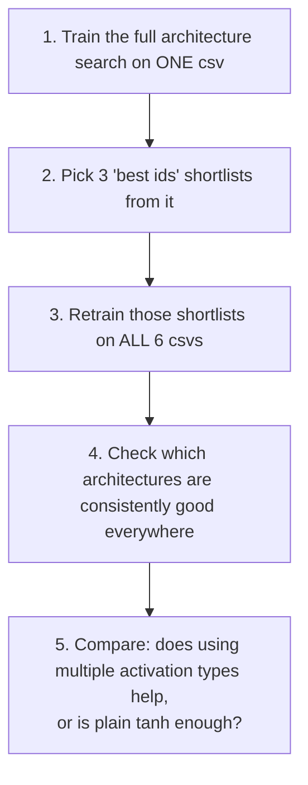

# Finding an architecture that works everywhere — the sweep methodology

This explains, in plain terms, how this project searches for a neural-network
architecture that isn't just good on *one* measurement, but reliably good
across *every* measurement CSV (i.e. every physical device sample tested).
Companion to [`MODEL_ARCHITECTURES.md`](MODEL_ARCHITECTURES.md) (how a single
model computes `Ids`) — this doc is about how *many* models get trained,
filtered, and compared.

The detailed, step-by-step reference commands live in
[`important_mds/base_9069_and_bestids_creation.md`](../important_mds/base_9069_and_bestids_creation.md)
and
[`important_mds/bestids_across_allcsvs_analysis_steps.md`](../important_mds/bestids_across_allcsvs_analysis_steps.md).
This doc is the "why and what, in order" companion to those.

## The big picture

Training thousands of architectures against **6 different measurement CSVs**
from the start would be enormously expensive. So the process is staged:
search cheaply on one CSV first, narrow down to a short list of promising
architectures, *then* pay the cost of testing that short list everywhere.

## 1. Train the full search on one CSV

A large architecture search — thousands of `(activation pattern, layer
count, neuron count)` combinations, split across **8 folders** by output
setup (e.g. `tanh_margin10`, `softplus`, `sigmoid_margin10`, each with a
"no gradient-matching-loss" counterpart) — is trained once against a single
measurement CSV. This is the expensive step, so it only happens once.

## 2. Pick 3 "best ids" shortlists

Training everything is expensive, but *evaluating* an already-trained model
on a new dataset is cheap (no training, just running it once). So instead of
retraining the entire thousands-strong search on every CSV, three much
smaller shortlists are picked out of it first (`extract_derived_configs.py`):

| Shortlist | How it's chosen | Typical size |
|---|---|---|
| **best200** | escalate a fit-quality bar until at least 200 architectures clear it, then keep the top 200 of those ranked by accuracy | 200 per folder |
| **bothshapeok** | every architecture whose predicted curve *looks* physically right (smooth, no wiggles or bumps — see `important_mds/shape_analysis_rules.md`), not capped | varies (a handful to over a thousand, folder-dependent) |
| **best100_gmshapeok** | same idea as best200, but restricted to the subset that at least passes the *simpler* half of the shape check | 100 per folder |

"Fit-quality bar" here specifically means a ceiling on `combined_gm` (an
error score combining the derivative-matching metrics) — the bar is
loosened step by step until enough architectures pass it.

## 3. Retrain the shortlists — this time, on all 6 CSVs

Now that the shortlists are small (a few hundred architectures per folder,
not thousands), it's affordable to actually retrain each one against **all
6 measurement CSVs**. This produces the real evidence needed for the next
step: how does each architecture perform on a device it wasn't originally
picked for?

## 4. Which architectures hold up everywhere?

With every shortlisted architecture now trained on every CSV,
`find_consistent_archs.py` looks for the ones that are good *consistently*,
not just on one CSV, using four different ways of scoring "consistent":

| Method | Plain-language question it answers |
|---|---|
| **A — worst-case accuracy** | Across all 6 CSVs, what's this architecture's accuracy *ranking* on its **worst** one? (Finds the architecture with no bad surprises anywhere, rather than one that's amazing on 5 CSVs and terrible on the 6th.) |
| **B — shape-consistency, all CSVs** | On how many of the 6 CSVs does this architecture's predicted curve *look* physically correct? |
| **C — shape-consistency, one specific pair** | Same as B, but restricted to two particular CSVs picked as a stricter stress-test. |
| **D — worst-case accuracy, one specific pair** | Same as A, restricted to that same pair. |

The results get written up as a readable report (`consistency_summary_*.md`)
plus plots of the winning architectures, so a person can look at the actual
curves, not just the numbers.

## 5. Homogeneous vs. heterogeneous — does mixing activation types help?

A **homogeneous** architecture uses the same activation function in every
neuron (e.g. `tanh` everywhere). A **heterogeneous** one mixes different
activation functions side by side in the same layer (e.g. some `tanh`
neurons and some `swish` neurons in one layer — see
[`MODEL_ARCHITECTURES.md §1`](MODEL_ARCHITECTURES.md#1-the-base-network)).

To find out whether mixing activations is actually worth the extra
complexity, the entire search from step 4 is **repeated a second time**,
restricted to *only* `tanh`-only (homogeneous) architectures, and the two
result sets are compared side by side
(`run_tanh_only_analysis.py` / `write_tanh_only_comparison.py`).

**Finding so far:** mixed-activation architectures usually win, sometimes by
a lot — in one measured case, the best `tanh`-only architecture ranked in
the worst 50% across CSVs, while the best mixed-activation architecture
ranked in the best ~20%. This isn't universal — some folders come out tied
(the same single architecture happens to win both searches) or even
occasionally favor `tanh`-only — so the actual verdict is checked per case,
not assumed.

## How the architectures themselves are generated

Every architecture is described as a string like
`[["tanh","tanh"],["tanh","swish","swish"]]` (see
[`MODEL_ARCHITECTURES.md §1`](MODEL_ARCHITECTURES.md#1-the-base-network)).
The codebase's built-in generator (`nn_architectures: "@GENERATE@"` in
`multi_experiment_runner.py`) builds two kinds automatically:

- **Homogeneous**: every neuron in every layer is `tanh`. Varies the number
  of layers (1–2) and neurons per layer (2–8, capped at 8 total neurons).
- **Heterogeneous**: each layer mixes `tanh` with exactly *one* other
  activation (`sigmoid`, `sin`, `cos`, `sinh`, `cosh`, `linear`, `swish`,
  `mish`, or `softplus`), at every possible tanh-to-other ratio within a
  layer (e.g. 3 tanh + 1 swish, 2 tanh + 2 swish, ...), same sizing limits
  as above.

This produces 316 distinct architectures — small and cheap enough to use as
a baseline search. (`multi_experiment_runner.py:117-148`.)

> **A note on the larger, one-off searches** (the "483pct"/"8586mixed"
> architecture pools mentioned in `important_mds/bestpicks10_run_ids.md`, and
> the ~9,000-architecture base search in `EXPERIMENT_LOG.md` round 12) used
> their own, more elaborate generator scripts — mixing *several* activation
> types at once per layer (not just tanh + one other) and non-uniform
> ("funnel") layer widths instead of a fixed size per layer. Those generator
> scripts lived outside `physics_nn_pipeline/` and aren't part of this
> repo's export — only their *output* (the resulting architecture lists,
> baked into the configs in `physics_nn_configs/`) is included. The
> homogeneous/heterogeneous distinction is the same idea either way, just
> scaled up.
